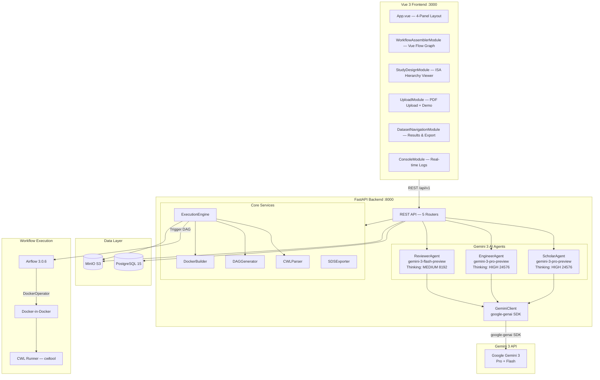

# VeriFlow

**Autonomous Research Reliability Engineer** — Converts scientific publications into verifiable, executable computational workflows using Gemini 3 AI agents.

Built for the [Gemini 3 Hackathon](https://gemini3.devpost.com/).

[![Contributors][contributors-shield]][contributors-url]
[![Stargazers][stars-shield]][stars-url]
[](https://GitHub.com/ABI-CTT-Group/VeriFlow/issues?q=is%3Aissue+is%3Aclosed)
[![Issues][issues-shield]][issues-url]
[![License][license-shield]][license-url]

[contributors-shield]: https://img.shields.io/github/contributors/ABI-CTT-Group/VeriFlow.svg?style=flat-square
[contributors-url]: https://github.com/ABI-CTT-Group/VeriFlow/graphs/contributors
[stars-shield]: https://img.shields.io/github/stars/ABI-CTT-Group/VeriFlow.svg?style=flat-square
[stars-url]: https://github.com/ABI-CTT-Group/VeriFlow/stargazers
[issues-shield]: https://img.shields.io/github/issues/ABI-CTT-Group/VeriFlow.svg?style=flat-square
[issues-url]: https://github.com/ABI-CTT-Group/VeriFlow/issues
[license-shield]: https://img.shields.io/github/license/ABI-CTT-Group/VeriFlow.svg?style=flat-square
[license-url]: https://github.com/ABI-CTT-Group/VeriFlow/blob/main/LICENSE

## Table of Contents

- [About](#about)
- [The Problem](#the-problem)
- [Our Solution](#our-solution---veriflow)
- [Gemini 3 Integration](#gemini-3-integration)
- [Architecture](#architecture)
- [Key Features](#key-features)
- [Data Flow Pipeline](#data-flow-pipeline)
- [Tech Stack](#tech-stack)
- [Quick Start](#quick-start)
- [Project Structure](#project-structure)
- [Testing](#testing)
- [Documentation](#documentation)

---

## About

VeriFlow is an end-to-end platform that tackles the **research reproducibility crisis** by autonomously converting scientific publications into executable computational workflows. Given a PDF of a research paper, VeriFlow uses three specialized Gemini 3 AI agents to extract the methodology, generate standards-compliant CWL v1.3 workflows with Docker containers, validate them, and execute them via Apache Airflow 3 — producing fully traceable, SPARC SDS-compliant results.

**Note**: This project was built for the [Gemini 3 Hackathon](https://gemini3.devpost.com/).

---

## The Problem

Scientific research faces a **reproducibility crisis**: studies report that 70%+ of researchers have failed to reproduce another scientist's experiment. Key barriers include:

- **Implicit methodology** — Critical experimental details are buried in PDF publications as unstructured text
- **Missing computational environments** — Papers describe tools and models without specifying exact versions, dependencies, or configurations
- **No executable artifacts** — Methodologies exist only as prose, not as runnable code
- **Manual workflow creation** — Converting a paper's methodology into an executable pipeline requires deep domain expertise and significant engineering effort

---

## Our Solution - VeriFlow

VeriFlow bridges the gap between scientific publications and executable workflows through an autonomous, AI-driven pipeline:

1. **Upload** a scientific publication (PDF)
2. **Scholar Agent** (Gemini 3 Pro) extracts the full methodology as a structured ISA-JSON hierarchy using native PDF upload, grounding with Google Search, and agentic vision for diagram analysis
3. **User selects** the specific assay/experiment to reproduce
4. **Engineer Agent** (Gemini 3 Pro) generates a complete CWL v1.3 workflow with Dockerfiles, tool definitions, and a visual graph using agentic function calling with think-act-observe loops
5. **Reviewer Agent** (Gemini 3 Flash) validates the workflow through combined local + semantic validation, with auto-fix capabilities using multi-turn thought signature preservation
6. **Airflow 3** executes the validated workflow via Docker-in-Docker with real-time progress monitoring
7. **Export** results as a SPARC SDS-compliant ZIP with full provenance tracking

---

## Gemini 3 Integration

VeriFlow leverages **7 Gemini 3 features** through the `google-genai` SDK (`from google import genai`):

| # | Feature | How It's Used | Agent(s) |
|---|---------|---------------|----------|
| 1 | **Pydantic Structured Output** | All agents use Pydantic `BaseModel` subclasses as `response_schema` parameter for type-safe, validated JSON responses (`AnalysisResult`, `WorkflowResult`, `ValidationResult`, `ErrorTranslationResult`) | All 3 |
| 2 | **Thinking Level Control** | `ThinkingConfig(thinking_budget=N)` — HIGH (24,576 tokens) for complex scientific reasoning, MEDIUM (8,192) for validation, LOW (2,048) for error translation | All 3 |
| 3 | **Grounding with Google Search** | `GoogleSearch()` tool verifies tool names, model architectures, and software references against the web during publication analysis | Scholar |
| 4 | **Native PDF Upload** | `client.files.upload()` for multimodal publication ingestion — the entire PDF is sent to Gemini for full-document analysis | Scholar |
| 5 | **Thought Signature Preservation** | `types.Part(thought=True, text=sig)` preserves reasoning chains across multi-turn conversations for iterative CWL generation and validation-fix loops | Engineer, Reviewer |
| 6 | **Agentic Vision** | Page image extraction via PyMuPDF for visual analysis of methodology diagrams, flowcharts, and figures | Scholar |
| 7 | **Agentic Function Calling** | Think-Act-Observe loops for iterative CWL workflow generation with local validation feedback (max 3 iterations) | Engineer |

### Agent Architecture

| Agent | Model | Thinking Budget | Responsibilities |
|-------|-------|-----------------|------------------|
| **ScholarAgent** | `gemini-3-pro-preview` | HIGH (24,576) | PDF analysis, ISA-JSON extraction, confidence scoring, tool/model identification |
| **EngineerAgent** | `gemini-3-pro-preview` | HIGH (24,576) | CWL v1.3 workflow generation, Dockerfile creation, Vue Flow graph layout |
| **ReviewerAgent** | `gemini-3-flash-preview` | MEDIUM (8,192) | CWL syntax validation, type compatibility checking, auto-fix, error translation |

### GeminiClient — Central SDK Wrapper

All Gemini 3 interactions go through a single `GeminiClient` class with three methods:

```python
from google import genai
from google.genai import types

class GeminiClient:
    def analyze_file(self, file_path, prompt, response_schema, thinking_level, enable_grounding):
        """Native PDF upload + structured output + thinking + grounding + local caching"""

    def generate_text(self, prompt, response_schema, thinking_level):
        """Text-only structured generation with thinking control"""

    def generate_with_history(self, messages, response_schema, thinking_level):
        """Multi-turn with thought signature preservation via types.Part(thought=True)"""
```

---

## Architecture



### Docker Compose — 9 Services

| Service | Port | Purpose |
|---------|------|---------|
| `backend` | 8000 | FastAPI backend (Python 3.11) |
| `frontend` | 3000 | Vue 3 SPA via Nginx |
| `postgres` | 5432 | PostgreSQL 15 database |
| `minio` | 9000/9001 | S3-compatible object storage (4 buckets) |
| `minio-init` | — | Ephemeral bucket initialization |
| `airflow-apiserver` | 8080 | Airflow 3.0.6 REST API server |
| `airflow-scheduler` | — | Airflow task scheduler (LocalExecutor) |
| `dind` | — | Docker-in-Docker for CWL execution |
| `cwl` | — | CWL runner (cwltool) |

---

## Key Features

### Autonomous PDF-to-Workflow Pipeline
Upload a scientific paper and VeriFlow autonomously extracts the methodology, generates executable workflows, validates them, and prepares them for execution — no manual intervention required.

### ISA-JSON Study Design Extraction
The Scholar Agent extracts structured investigation hierarchies following the ISA (Investigation-Study-Assay) standard, with per-field confidence scores and source page references.

### CWL v1.3 Workflow Generation
The Engineer Agent produces standards-compliant Common Workflow Language workflows with:
- Step-by-step `CommandLineTool` definitions
- Auto-generated Dockerfiles for each tool
- Data format adapters between incompatible step types
- Visual workflow graph for the Vue Flow canvas

### Iterative Validation with Auto-Fix
The Reviewer Agent combines:
- **Local validation**: cwltool syntax checking, type compatibility analysis, dependency resolution
- **Semantic validation**: Gemini-powered analysis of scientific correctness
- **Auto-fix loop**: Up to 3 iterations of validate-fix-regenerate using thought signature preservation

### Real-time Workflow Execution
Execute validated workflows through Apache Airflow 3.0.6 with:
- Docker-in-Docker containerized execution via cwltool
- Real-time WebSocket log streaming
- Per-node progress tracking with status visualization

### SPARC SDS-Compliant Export
Export results as a standards-compliant ZIP containing:
- `dataset_description.json` — Dataset metadata
- `manifest.xlsx` — File manifest with checksums
- `provenance.json` — W3C PROV derivation tracking
- `derivative/` — Output files organized by execution step

### Interactive 4-Panel UI
Vue 3 frontend with:
- **Left**: PDF upload + ISA hierarchy viewer with confidence scores
- **Center**: Interactive Vue Flow workflow graph with custom nodes
- **Right**: Results visualization and SDS export
- **Bottom**: Real-time console with agent log streaming

---

## Data Flow Pipeline

```
Scientific Publication (PDF)
        |
        v
  [Upload to MinIO + Temp File]
        |
        v
  ScholarAgent (Gemini 3 Pro)
  - Native PDF Upload
  - Grounding with Google Search
  - Pydantic Structured Output (AnalysisResult)
  - Thinking: HIGH (24,576)
        |
        v
  ISA-JSON Hierarchy + Confidence Scores
        |
        v
  [User Selects Assay]
        |
        v
  EngineerAgent (Gemini 3 Pro)
  - Pydantic Structured Output (WorkflowResult)
  - Agentic Function Calling (validate-fix loops)
  - Thinking: HIGH (24,576)
        |
        v
  CWL Workflow + Dockerfiles + Vue Flow Graph
        |
        v
  ReviewerAgent (Gemini 3 Flash)
  - Pydantic Structured Output (ValidationResult)
  - Thought Signature Preservation
  - Thinking: MEDIUM (8,192)
        |
    Valid? --No--> Auto-Fix Loop (max 3 iterations)
        |
       Yes
        |
        v
  ExecutionEngine --> CWLParser --> DAGGenerator
        |
        v
  Airflow 3.0.6 --> DockerOperator --> cwltool
        |
        v
  SDS ZIP Export (dataset_description + manifest + provenance)
```

---

## Tech Stack

| Layer | Technology |
|-------|------------|
| **AI** | Gemini 3 (`google-genai` SDK) — `gemini-3-pro-preview`, `gemini-3-flash-preview` |
| **Backend** | Python 3.11, FastAPI, Pydantic, uvicorn |
| **Frontend** | Vue 3.5, Vue Flow 1.41, Pinia, Tailwind CSS 4, TypeScript, Vite 6 |
| **Execution** | Apache Airflow 3.0.6 (LocalExecutor), CWL v1.3, Docker-in-Docker, cwltool |
| **Storage** | PostgreSQL 15, MinIO (S3-compatible, 4 buckets) |
| **Standards** | ISA-JSON, SPARC SDS, CWL v1.3, W3C PROV |

---

## Quick Start

### Prerequisites

- Docker & Docker Compose
- A Gemini API key from [Google AI Studio](https://aistudio.google.com/)

### Setup

```bash
# 1. Clone the repository
git clone https://github.com/ABI-CTT-Group/VeriFlow.git
cd VeriFlow

# 2. Configure environment
cp .env.example .env
# Edit .env and add your GEMINI_API_KEY

# 3. Start all services
docker compose up -d

# 4. Open the app
# Frontend:        http://localhost:3000
# Backend API:     http://localhost:8000/docs
# Airflow UI:      http://localhost:8080
# MinIO Console:   http://localhost:9001
```

### Development (without Docker)

```bash
# Backend
cd backend
pip install -r requirements.txt
uvicorn app.main:app --reload --port 8000

# Frontend
cd frontend
npm install
npm run dev
```

---

## Project Structure

```
VeriFlow/
+-- backend/                     # Python FastAPI backend
|   +-- app/
|   |   +-- agents/              # ScholarAgent, EngineerAgent, ReviewerAgent
|   |   +-- api/                 # 5 REST API routers
|   |   +-- models/              # Pydantic schemas (Gemini structured output)
|   |   +-- services/            # GeminiClient, CWLParser, DAGGenerator, etc.
|   |   +-- main.py              # FastAPI entry point
|   +-- config.yaml              # Agent model & thinking level configuration
|   +-- prompts.yaml             # Versioned prompt templates per agent
|   +-- tests/                   # 163 pytest tests (unit + integration)
+-- frontend/                    # Vue 3 + TypeScript + Tailwind CSS 4
|   +-- src/
|   |   +-- components/          # 17 Vue components
|   |   +-- stores/              # Pinia workflow store
|   |   +-- services/            # API client (axios)
|   |   +-- utils/               # dagre layout utilities
+-- airflow/                     # Custom Airflow 3.0.6 image + DAGs
+-- cwl/                         # CWL runner service (cwltool)
+-- docs/                        # Architecture diagrams (Mermaid, draw.io)
+-- docker-compose.yml           # 9-service orchestration
+-- .env.example                 # Environment variable template
+-- SPEC.md                      # Technical specification
```

---

## Testing

```bash
# Backend unit tests (163 tests)
cd backend && python -m pytest tests/ -v

# Backend tests in Docker
docker compose run --rm backend pytest tests/ -v

# Frontend tests (Vitest)
cd frontend && npx vitest run
```

---

## Documentation

- [Technical Specification](SPEC.md) — Full implementation spec with API endpoints, data structures, and agent details
- [Architecture Diagrams](docs/architecture.html) — 8 interactive Mermaid diagrams (system infrastructure, data flow, Gemini integration, etc.)
- [System Infrastructure (draw.io)](docs/architecture-system-infrastructure.drawio) — Editable system architecture diagram
