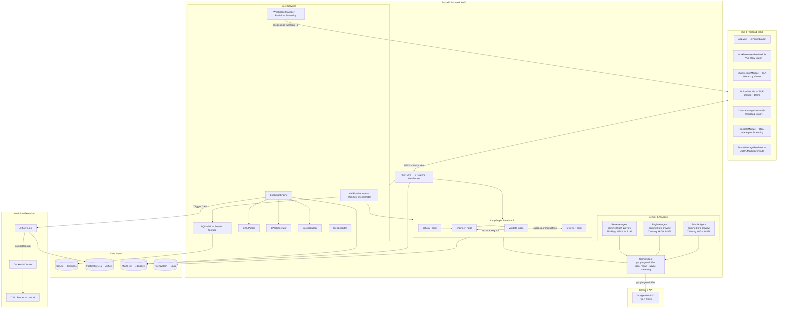

# VeriFlow

**Autonomous Research Reliability Engineer** — Converts scientific publications into verifiable, executable computational workflows using Gemini 3 AI agents.

Built for the [Gemini 3 Hackathon](https://gemini3.devpost.com/).

[![Contributors][contributors-shield]][contributors-url]
[![Stargazers][stars-shield]][stars-url]
[](https://GitHub.com/ABI-CTT-Group/VeriFlow/issues?q=is%3Aissue+is%3Aclosed)
[![Issues][issues-shield]][issues-url]
[![License][license-shield]][license-url]

[contributors-shield]: https://img.shields.io/github/contributors/ABI-CTT-Group/VeriFlow.svg?style=flat-square
[contributors-url]: https://github.com/ABI-CTT-Group/VeriFlow/graphs/contributors
[stars-shield]: https://img.shields.io/github/stars/ABI-CTT-Group/VeriFlow.svg?style=flat-square
[stars-url]: https://github.com/ABI-CTT-Group/VeriFlow/stargazers
[issues-shield]: https://img.shields.io/github/issues/ABI-CTT-Group/VeriFlow.svg?style=flat-square
[issues-url]: https://github.com/ABI-CTT-Group/VeriFlow/issues
[license-shield]: https://img.shields.io/github/license/ABI-CTT-Group/VeriFlow.svg?style=flat-square
[license-url]: https://github.com/ABI-CTT-Group/VeriFlow/blob/main/LICENSE

## Table of Contents

- [About](#about)
- [The Problem](#the-problem)
- [Our Solution](#our-solution---veriflow)
- [Gemini 3 Integration](#gemini-3-integration)
- [Architecture](#architecture)
- [Key Features](#key-features)
- [Data Flow Pipeline](#data-flow-pipeline)
- [Tech Stack](#tech-stack)
- [Quick Start](#quick-start)
- [Project Structure](#project-structure)
- [Testing](#testing)
- [Documentation](#documentation)
- [License](#license)
- [Team](#team)
- [Acknowledgements](#acknowledgements)

---

## About

VeriFlow is an end-to-end platform that tackles the **research reproducibility crisis** by autonomously converting scientific publications into executable computational workflows. Given a PDF of a research paper, VeriFlow uses a **LangGraph-orchestrated pipeline** of three specialized Gemini 3 AI agents to extract the methodology, generate standards-compliant CWL v1.3 workflows with Docker containers, validate them through a self-healing retry loop, and review the output for scientific correctness — all with real-time WebSocket streaming to an interactive Vue 3 frontend.

**Note**: This project was built for the [Gemini 3 Hackathon](https://gemini3.devpost.com/).

---

## The Problem

Scientific research faces a **reproducibility crisis**: studies report that 70%+ of researchers have failed to reproduce another scientist's experiment. Key barriers include:

- **Implicit methodology** — Critical experimental details are buried in PDF publications as unstructured text
- **Missing computational environments** — Papers describe tools and models without specifying exact versions, dependencies, or configurations
- **No executable artifacts** — Methodologies exist only as prose, not as runnable code
- **Manual workflow creation** — Converting a paper's methodology into an executable pipeline requires deep domain expertise and significant engineering effort

---

## Our Solution - VeriFlow

VeriFlow bridges the gap between scientific publications and executable workflows through an autonomous, AI-driven pipeline:

1. **Upload** a scientific publication (PDF) with optional user context
2. **Scholar Agent** (Gemini 3 Pro) extracts the full methodology as a structured ISA-JSON hierarchy using native PDF upload, grounding with Google Search, and agentic vision for diagram analysis
3. **Engineer Agent** (Gemini 3 Pro) generates a complete CWL v1.3 workflow with Dockerfiles, tool definitions, and infrastructure code using the extracted ISA-JSON and repository context
4. **Validate Node** checks generated artifacts for structural correctness (Dockerfile has FROM, CWL has cwlVersion) — if errors are found, the self-healing loop retries the Engineer up to 3 times with error context
5. **Reviewer Agent** (Gemini 3 Flash) critiques the final output for scientific correctness, comparing the ISA extraction against the generated code
6. **Plan & Apply** — Users can chat with any agent, refine directives, and restart the workflow from any node
7. **Export** results as a SPARC SDS-compliant ZIP with full provenance tracking

---

## Gemini 3 Integration

VeriFlow leverages **4 Gemini 3 features** through the `google-genai` SDK (`from google import genai`):

| # | Feature | How It's Used | Agent(s) |
|---|---------|---------------|----------|
| 1 | **Pydantic Structured Output** | All agents use Pydantic `BaseModel` subclasses as `response_schema` parameter with `response_mime_type="application/json"` for type-safe, validated JSON responses (`AnalysisResult`, `WorkflowResult`, `ValidationResult`, `ErrorTranslationResult`) | All 3 |
| 2 | **Native PDF Upload** | `types.Part.from_bytes(data=file_data, mime_type="application/pdf")` for multimodal publication ingestion — the entire PDF is sent to Gemini for full-document analysis | Scholar |
| 3 | **Thought Signature Preservation** | `_extract_thoughts()` captures reasoning chains from `response.candidates[].content.parts` where `part.thought == True`, preserving reasoning across multi-turn conversations for iterative CWL generation and validation-fix loops | Engineer, Reviewer |
| 4 | **Async Streaming** | `client.aio.models.generate_content_stream()` for real-time token-by-token streaming via WebSocket to the frontend console | All 3 |

### Agent Architecture

| Agent | Model | Thinking Budget | Responsibilities |
|-------|-------|-----------------|------------------|
| **ScholarAgent** | `gemini-3-pro-preview` | HIGH (24,576) | PDF analysis, ISA-JSON extraction, confidence scoring, tool/model identification |
| **EngineerAgent** | `gemini-3-pro-preview` | HIGH (24,576) | CWL v1.3 workflow generation, Dockerfile creation, infrastructure code |
| **ReviewerAgent** | `gemini-3-flash-preview` | MEDIUM (8,192) | ISA vs code critique, scientific correctness validation, approval/rejection decision |

### GeminiClient — Central SDK Wrapper

All Gemini 3 interactions go through a single `GeminiClient` class:

```python
from google import genai
from google.genai import types

class GeminiClient:
    model_name = "gemini-3.0-flash"  # Default fallback

    async def analyze_file(self, file_path, prompt, model, stream_callback):
        """Native PDF upload via Part.from_bytes + JSON response + async streaming"""

    async def generate_content(self, prompt, model, response_schema, stream_callback):
        """Text-only structured generation with optional streaming"""

    def _extract_thoughts(self, response) -> List[str]:
        """Chain-of-thought extraction from response candidates"""

    def _robust_parse_json(self, text) -> Dict:
        """json_repair-based parsing for Markdown backticks and malformed JSON"""
```

---

## Architecture



### Docker Compose — 10 Services

| Service | Port | Purpose |
|---------|------|---------|
| `backend` | 8000 | FastAPI backend (Python 3.11) |
| `frontend` | 3000 | Vue 3 SPA via Nginx |
| `postgres` | 5432 | PostgreSQL 15 (Airflow database) |
| `minio` | 9000/9001 | S3-compatible object storage (4 buckets) |
| `minio-init` | — | Ephemeral bucket initialization |
| `airflow-apiserver` | 8080 | Airflow 3.0.6 REST API server |
| `airflow-scheduler` | — | Airflow task scheduler (LocalExecutor) |
| `dind` | — | Docker-in-Docker for CWL execution |
| `cwl` | — | CWL runner (cwltool) |
| `veriflow-sandbox` | — | Sandbox for script execution (PyTorch + nnU-Net) |

---

## Key Features

### LangGraph-Orchestrated Multi-Agent Pipeline
A `StateGraph` with 4 nodes (Scholar, Engineer, Validate, Reviewer) orchestrates the full PDF-to-workflow pipeline. Conditional edges enable a self-healing retry loop where validation failures automatically route back to the Engineer with error context, up to 3 iterations.

### Autonomous PDF-to-Workflow Pipeline
Upload a scientific paper and VeriFlow autonomously extracts the methodology, generates executable workflows, validates them through a self-healing loop, and reviews them for scientific correctness — no manual intervention required.

### ISA-JSON Study Design Extraction
The Scholar Agent extracts structured investigation hierarchies following the ISA (Investigation-Study-Assay) standard, with per-field confidence scores and source page references using Gemini 3's native PDF upload.

### CWL v1.3 Workflow Generation
The Engineer Agent produces standards-compliant Common Workflow Language workflows with:
- Step-by-step `CommandLineTool` definitions with `InitialWorkDirRequirement` embedded scripts
- Auto-generated Dockerfiles for each tool
- Data format adapters between incompatible step types
- Repository context analysis (reads repo files up to 50KB for informed generation)

### Self-Healing Validation Loop
The Validate node checks generated artifacts and the LangGraph conditional edges route:
- **Back to Engineer** (retry with error context) if validation fails and `retry_count < 3`
- **Forward to Reviewer** (final critique) if validation passes or max retries reached

### Plan & Apply — Interactive Agent Consultation
Users can chat with any agent about their output, formulate specific directives, and restart the workflow from any node with those directives applied:
- `POST /api/v1/chat/{run_id}/{agent_name}` — Discuss agent output
- `POST /api/v1/chat/{run_id}/{agent_name}/apply` — Apply directive and restart

### Real-time WebSocket Streaming
All agent output is streamed token-by-token via WebSocket to the frontend console using Gemini 3's `generate_content_stream()` API, with the `SmartMessageRenderer` component providing intelligent rendering of JSON, Markdown, Dockerfiles, and CWL code blocks.

### SPARC SDS-Compliant Export
Export results as a standards-compliant ZIP containing:
- `dataset_description.json` — Dataset metadata
- `manifest.xlsx` — File manifest with checksums
- `provenance.json` — W3C PROV derivation tracking
- `derivative/` — Output files organized by execution step

### Interactive 4-Panel UI
Vue 3 frontend with:
- **Left**: PDF upload + ISA hierarchy viewer with confidence scores
- **Center**: Interactive Vue Flow workflow graph with custom nodes
- **Right**: Results visualization and SDS export
- **Bottom**: Real-time console with agent streaming via SmartMessageRenderer

---

## Data Flow Pipeline

```
Scientific Publication (PDF) + User Context + Repository Path
        |
        v
  [POST /api/v1/orchestrate]
        |
        v
  VeriFlowService.run_workflow()
        |
        v
  +=== LangGraph StateGraph ================================+
  |                                                          |
  |  ScholarAgent (Gemini 3 Pro)                             |
  |  - Native PDF Upload (Part.from_bytes)                   |
  |  - Grounding with Google Search                          |
  |  - Pydantic Structured Output (AnalysisResult)           |
  |  - Thinking: HIGH (24,576) + Async Streaming             |
  |        |                                                 |
  |        v                                                 |
  |  ISA-JSON Hierarchy + Confidence Scores                  |
  |        |                                                 |
  |        v                                                 |
  |  EngineerAgent (Gemini 3 Pro)                            |
  |  - Pydantic Structured Output (WorkflowResult)           |
  |  - Repository Context (up to 50KB of source files)       |
  |  - Previous validation_errors injected into prompt       |
  |  - Thinking: HIGH (24,576) + Async Streaming             |
  |        |                                                 |
  |        v                                                 |
  |  CWL Workflow + Dockerfiles + Infrastructure Code        |
  |        |                                                 |
  |        v                                                 |
  |  Validate Node (System)                                  |
  |  - Dockerfile has FROM instruction?                      |
  |  - CWL has cwlVersion declaration?                       |
  |        |                                                 |
  |    Valid? --No + retry<3--> Back to Engineer              |
  |        |                                                 |
  |       Yes (or max retries)                               |
  |        |                                                 |
  |        v                                                 |
  |  ReviewerAgent (Gemini 3 Flash)                          |
  |  - ISA vs Generated Code critique                        |
  |  - Thought Signature Preservation                        |
  |  - Thinking: MEDIUM (8,192) + Async Streaming            |
  |  - Decision: approved / rejected                         |
  |                                                          |
  +=========================================================+
        |
        v (WebSocket streaming throughout)
  Vue 3 Frontend — Real-time Console + ISA Viewer + Graph
        |
        v (optional)
  ExecutionEngine --> CWLParser --> DAGGenerator
        |
        v
  Airflow 3.0.6 --> DockerOperator --> cwltool
        |
        v
  SDS ZIP Export (dataset_description + manifest + provenance)
```

---

## Tech Stack

| Layer | Technology |
|-------|------------|
| **AI** | Gemini 3 (`google-genai` SDK) — `gemini-3-pro-preview`, `gemini-3-flash-preview` |
| **Orchestration** | LangGraph (`StateGraph` with conditional edges, self-healing retry loop) |
| **Backend** | Python 3.11, FastAPI, Pydantic, uvicorn, json-repair |
| **Frontend** | Vue 3.5, Vue Flow 1.41, Pinia, Tailwind CSS 4, TypeScript, Vite 6, markdown-it |
| **Real-time** | WebSocket (FastAPI native), SmartMessageRenderer |
| **Execution** | Apache Airflow 3.0.6 (LocalExecutor), CWL v1.3, Docker-in-Docker, cwltool |
| **Storage** | SQLite (sessions), PostgreSQL 15 (Airflow), MinIO (S3-compatible, 4 buckets) |
| **Standards** | ISA-JSON, SPARC SDS, CWL v1.3, W3C PROV |

---

## Quick Start

### Prerequisites

- Docker & Docker Compose
- A Gemini API key from [Google AI Studio](https://aistudio.google.com/)

### Setup

```bash
# 1. Clone the repository
git clone https://github.com/ABI-CTT-Group/VeriFlow.git
cd VeriFlow

# 2. Configure environment
cp .env.example .env
# Edit .env and add your GEMINI_API_KEY

# 3. Start all services
docker compose up -d

# 4. Open the app
# Frontend:        http://localhost:3000
# Backend API:     http://localhost:8000/docs
# Airflow UI:      http://localhost:8080
# MinIO Console:   http://localhost:9001
```

### Development (without Docker)

```bash
# Backend
cd backend
pip install -r requirements.txt
uvicorn app.main:app --reload --port 8000

# Frontend
cd frontend
npm install
npm run dev
```

---

## Project Structure

```
VeriFlow/
+-- backend/                     # Python FastAPI backend
|   +-- app/
|   |   +-- agents/              # ScholarAgent, EngineerAgent, ReviewerAgent (class-based)
|   |   +-- api/                 # 5 REST API routers + WebSocket endpoint
|   |   +-- graph/               # LangGraph StateGraph + node implementations
|   |   |   +-- workflow.py      # StateGraph definition with conditional edges
|   |   |   +-- nodes.py         # scholar_node, engineer_node, validate_node, reviewer_node
|   |   +-- models/              # Pydantic schemas (Gemini structured output)
|   |   +-- services/            # GeminiClient, VeriFlowService, WebSocketManager, SQLiteDB
|   |   +-- state.py             # AgentState TypedDict (LangGraph shared state)
|   |   +-- main.py              # FastAPI entry point
|   +-- config.yaml              # Agent model & thinking level configuration
|   +-- prompts.yaml             # Versioned prompt templates per agent
|   +-- examples/                # Pre-computed agent outputs for MAMA-MIA demo
|   +-- tests/                   # pytest tests (unit + integration)
+-- frontend/                    # Vue 3 + TypeScript + Tailwind CSS 4
|   +-- src/
|   |   +-- components/          # Vue components including SmartMessageRenderer
|   |   +-- stores/              # Pinia workflow + console stores
|   |   +-- services/            # API client (axios) + WebSocket service
|   |   +-- utils/               # dagre layout utilities
+-- airflow/                     # Custom Airflow 3.0.6 image + DAGs
+-- cwl/                         # CWL runner service (cwltool)
+-- sandbox/                     # Sandbox Docker environment (PyTorch + nnU-Net)
+-- docs/                        # Architecture diagrams (Mermaid, draw.io, about, testing)
+-- docker-compose.yml           # 10-service orchestration (development)
+-- docker-compose.prod.yml      # Production configuration (GHCR images)
+-- .env.example                 # Environment variable template
+-- SPEC.md                      # Technical specification
```

---

## Testing

```bash
# Backend unit tests
cd backend && python -m pytest tests/ -v

# Backend tests in Docker
docker compose run --rm backend pytest tests/ -v

# Frontend tests (Vitest)
cd frontend && npx vitest run
```

---

## Documentation

- [Technical Specification](SPEC.md) — Full implementation spec with API endpoints, data structures, and agent details

## License

VeriFlow is fully open source and distributed under the Apache License 2.0. See [LICENSE](https://github.com/ABI-CTT-Group/VeriFlow/blob/main/LICENSE) for more information.

## Team

- Thiranja Prasad Babarenda Gamage
- Jagir Hussan
- Tim Wu
- Linkun Gao
- Patrick Zhang
- Emily Clark Murphy
- Holly Hogan-Murphy
- Chinchien Lin

  
## Acknowledgements

- We would like to thank the organizers of the [Gemini Hachathon](https://gemini3.devpost.com/?_gl=1*blvul0*_gcl_au*Njk3Mjg1OTYxLjE3Njc4Mjk3NDk.*_ga*MTkyMDMzMjMyNy4xNzY3ODI5NzUw*_ga_0YHJK3Y10M*czE3NzA2ODIwMjAkbzYkZzEkdDE3NzA2ODIxNTUkajYwJGwwJGgw) for organising this event and all the support doucmnetation
- [ARDC Nectar Research Cloud](https://ardc.edu.au/services/ardc-nectar-research-cloud/) for providing the infrasture for hosting this project

