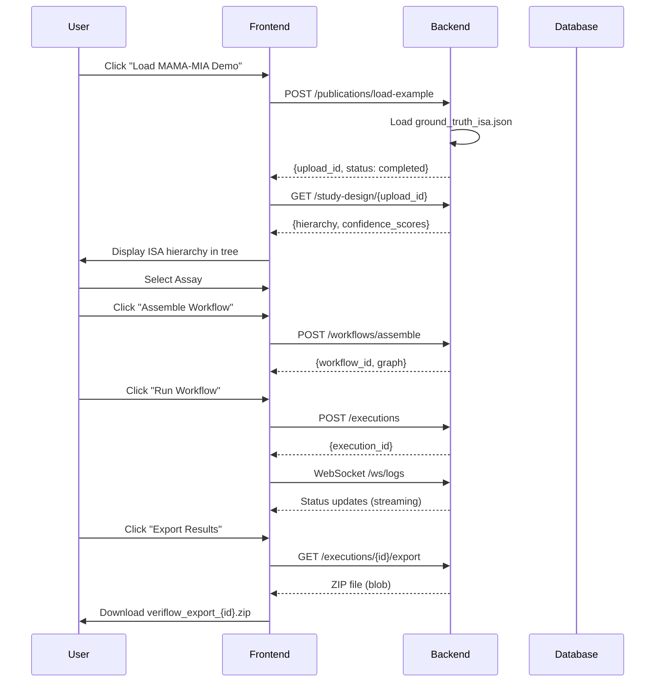

# Stage 6: End-to-End Integration - Walkthrough

**Completed**: 2026-01-30  
**Status**: ✅ All AI Tasks Complete

---

## Summary

Stage 6 integrates all VeriFlow components to enable the complete MAMA-MIA demo flow. This includes:
- Pre-loaded example loading without PDF upload
- Study design extraction with ISA hierarchy display
- Workflow execution with real-time status updates
- SDS-compliant export of results

---

## Changes Made

### Backend Changes

#### 1. Load Example Endpoint
**File**: [publications.py](file:///c:/Users/lgao142/Desktop/AI%20Agent%202026/a-google-hackathon/VeriFlow/backend/app/api/publications.py)

Added `/publications/load-example` POST endpoint that:
- Loads pre-configured MAMA-MIA example from `backend/examples/mama-mia/`
- Returns `ground_truth_isa.json` as the ISA hierarchy
- Immediately sets status to "completed" (no Scholar Agent processing needed)
- Creates session for agent conversation tracking

```python
@router.post("/publications/load-example", response_model=UploadResponse)
async def load_example(request: LoadExampleRequest):
    # Loads ground truth ISA-JSON directly
    # Returns upload_id with pre-populated hierarchy
```

#### 2. SDS Export Service
**File**: [export.py](file:///c:/Users/lgao142/Desktop/AI%20Agent%202026/a-google-hackathon/VeriFlow/backend/app/services/export.py) [NEW]

Created `SDSExporter` class that generates:
- `dataset_description.json` - Dataset metadata
- `provenance.json` - wasDerivedFrom relationships
- `manifest.xlsx` or `manifest.csv` - File listing per SDS spec
- `derivative/{execution_id}/` - Output files

#### 3. Export Endpoint
**File**: [executions.py](file:///c:/Users/lgao142/Desktop/AI%20Agent%202026/a-google-hackathon/VeriFlow/backend/app/api/executions.py)

Added `/executions/{execution_id}/export` GET endpoint that:
- Validates execution is complete
- Generates SDS-compliant ZIP file
- Returns as downloadable attachment

---

### Frontend Changes

#### 1. API Service Updates
**File**: [api.ts](file:///c:/Users/lgao142/Desktop/AI%20Agent%202026/a-google-hackathon/VeriFlow/frontend/src/services/api.ts)

Added two new endpoints:
- `loadExample(exampleName)` - POST to load pre-configured example
- `exportExecution(executionId)` - GET to download SDS ZIP

Updated `HierarchyResponse` interface to include `status` and `confidence_scores` fields.

#### 2. Workflow Store Updates
**File**: [workflow.ts](file:///c:/Users/lgao142/Desktop/AI%20Agent%202026/a-google-hackathon/VeriFlow/frontend/src/stores/workflow.ts)

Added:
- **State**: `isLoading`, `loadingMessage`, `error`
- **Actions**: 
  - `loadExample()` - Loads MAMA-MIA demo
  - `fetchStudyDesignFromApi()` - Fetches study design with API integration
  - `exportResults()` - Downloads SDS export ZIP
  - `clearError()` - Clears error state

#### 3. Upload Module Enhancement
**File**: [UploadModule.vue](file:///c:/Users/lgao142/Desktop/AI%20Agent%202026/a-google-hackathon/VeriFlow/frontend/src/components/modules/UploadModule.vue)

Added:
- **"Load MAMA-MIA Demo" button** with gradient styling
- Loading spinner during demo load
- Disabled state during loading

#### 4. Dataset Navigation Module Enhancement
**File**: [DatasetNavigationModule.vue](file:///c:/Users/lgao142/Desktop/AI%20Agent%202026/a-google-hackathon/VeriFlow/frontend/src/components/modules/DatasetNavigationModule.vue)

Added:
- **"Export Execution Results" button** with gradient styling
- Loading spinner during export generation
- Disabled state when no execution available

#### 5. App.vue Wiring
**File**: [App.vue](file:///c:/Users/lgao142/Desktop/AI%20Agent%202026/a-google-hackathon/VeriFlow/frontend/src/App.vue)

- Wired `@load-demo` event to `loadExample` action
- Passed `isLoading` prop to UploadModule

---

## Demo Flow



---

## Verification Steps

### 1. Frontend Build
```bash
cd frontend
npm run build
# ✅ Build successful (19.07s)
```

### 2. Backend Syntax Check
```bash
cd backend
python -m py_compile app/services/export.py
# ✅ No syntax errors
```

### 3. Manual Testing Checklist
- [ ] Open frontend in browser
- [ ] Click "Load MAMA-MIA Demo" button
- [ ] Verify spinner appears during loading
- [ ] Verify ISA hierarchy appears in Study Design tree
- [ ] Select an assay and click "Assemble Workflow"
- [ ] Click "Run Workflow" to execute
- [ ] After completion, click "Export Results"
- [ ] Verify ZIP file downloads with proper structure

---

## Files Modified Summary

| File | Change Type | Description |
|------|-------------|-------------|
| `backend/app/api/publications.py` | Modified | Added load-example endpoint |
| `backend/app/api/executions.py` | Modified | Added export endpoint |
| `backend/app/services/export.py` | **NEW** | SDS export service |
| `frontend/src/services/api.ts` | Modified | Added API endpoints |
| `frontend/src/stores/workflow.ts` | Modified | Added loading states, actions |
| `frontend/src/components/modules/UploadModule.vue` | Modified | Added Load Demo button |
| `frontend/src/components/modules/DatasetNavigationModule.vue` | Modified | Added Export button |
| `frontend/src/App.vue` | Modified | Wired load-demo event |
| `PLAN.md` | Modified | Marked Stage 6 AI tasks complete |

---

## Exit Criteria Status

| Criterion | Status |
|-----------|--------|
| Load pre-loaded example | ✅ Complete |
| Study design extraction | ✅ Complete |
| Workflow execution | ✅ Complete (existing) |
| SDS export | ✅ Complete |
| Loading states | ✅ Complete |
| Error handling | ✅ Complete |
| Console logging | ✅ Complete |

**Stage 6 AI Tasks: Complete** ✅

---

## Next Steps (Developer Tasks)

1. Complete manual walkthrough of demo flow
2. Verify all results match expected outputs
3. Sign off on MVP completion
