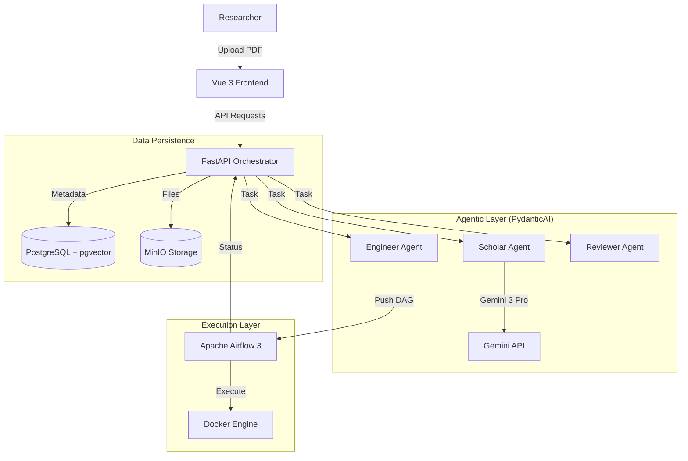

# VeriFlow MVP Specification

> **Status:** Draft
> **Date:** 2026-01-21
> **Based on:** `PRD.md`, `INTERVIEW.md`

## 1. System Overview

VeriFlow is an autonomous "Research Reliability Engineer" that converts scientific papers (PDFs) into verifiable, executable verification workflows.

**Core Loop:**
1.  **Ingest:** Upload PDF.
2.  **Extract:** "Scholar Agent" identifies Study Design (ISA) and Tools.
3.  **Construct:** User assembles workflow visually (ComfyUI-style).
4.  **Engineer:** "Engineer Agent" generates standard CWL + Docker containers.
5.  **Execute:** System runs workflow on Airflow 3 using the paper's data.

---

## 2. Architecture & Tech Stack

### 2.1 Stack Decisions
| Layer | Choice | Rationale |
| :--- | :--- | :--- |
| **Frontend** | **Vue 3 + TypeScript + Vite** | Performance, clean composition API. |
| **CSS** | **Tailwind CSS** | Styling matching `docs/UI.png`. |
| **Graph UI** | **Vue Flow** | ComfyUI-like node editing (typed ports, wires). |
| **Backend** | **FastAPI** (Python 3.12+) | Async support, Pydantic integration. |
| **Agents** | **PydanticAI + Gemini 3 Pro** | Strong typing; state-of-the-art reasoning/context. |
| **Database** | **PostgreSQL + pgvector** | Metadata, Airflow DB, Agent Memory. |
| **Storage** | **MinIO** (S3 Compatible) | PDFs, Images, SDS Directory artifacts. |
| **Executor** | **Apache Airflow 3** | Industry standard orchestration. |
| **Infrastructure**| **Docker Compose / Nectar Cloud** | Containerized deployment. |

### 2.2 System Diagram

---

## 3. Component Specifications

### 3.1 Frontend (Vue 3)

**Global Theme:**
- Dark/Glassmorphism aesthetic (ref: `docs/UI.png`).
- Font: Inter or similar clean sans-serif.

**Modules:**
1.  **Upload & Dashboard**: Drag-and-drop PDF. Project list.
2.  **Study Design (ISA) Viewer**: Tree view of Investigation -> Study -> Assay.
3.  **Workflow Assembler (Vue Flow)**:
    - **Visuals**: Dark nodes, colored curves (ComfyUI style).
    - **Nodes**:
        - *Input Node*: Dataset selection.
        - *Tool Node*: Dynamic ports (Inputs/Outputs) based on extracted tool signature.
        - *Model Node*: Weights/Parameters.
    - **Interaction**: Drag connection between compatible MIME types.
4.  **Console**: Streaming logs from Agents and Airflow.

### 3.2 Backend (FastAPI)

**API Endpoints:**
- `POST /projects/upload`: Ingest PDF -> MinIO -> Trigger Scholar.
- `GET /projects/{id}/sds`: Retrieve current ISA/SDS structure.
- `POST /workflow/compile`: Convert Graph JSON -> CWL -> Airflow DAG.
- `POST /workflow/run`: Trigger Airflow DAG.
- `WS /events`: WebSocket for real-time Agent/Airflow status updates.

### 3.3 Agents (PydanticAI)

**Configuration:**
- **Model Selection**: User must be able to configure the specific Gemini model (e.g., Gemini 3 Pro, Flash, Ultra) *per agent* via a Settings/Configuration menu.
- **Default**: **Gemini 3 Pro** for all agents.

**A. The Scholar (Extraction)**
- **Input**: Raw PDF Text.
- **Output**: Structured `StudyDesign` (ISA format).
- **Task**: Identify Tools (inputs/outputs), Measurements, and experimental logic.

**B. The Engineer (Implementation)**
- **Input**: `ToolNode` specifications.
- **Output**:
    - `Dockerfile`: Generated based on language (Python/R) and imports.
    - `Tool.cwl`: CommandLineTool definition.
- **Action**: Builds Docker image via local Docker Socket.

**C. The Reviewer (Validation)**
- **Input**: Execution Logs, Error Traces.
- **Output**: Fix suggestions, Confidence Score.

### 3.4 Data Models (PostgreSQL)

**Tables:**
- `projects`: id, name, status, created_at.
- `artifacts`: project_id, s3_path, artifact_type (PDF, SDS, Dockerfile).
- `runs`: project_id, airflow_run_id, status.
- `agent_memory`: vector embeddings of decisions/citations.

---

## 4. Implementation Plan

### Phase 1: Foundation (Current Task)
1.  Setup Monorepo (`ui/`, `backend/`, `airflow/`).
2.  Initialize **Vue 3 + Tailwind** project with basic layout.
3.  Initialize **FastAPI** with Postgres/MinIO connection.

### Phase 2: Scholar & Extraction
1.  Implement PDF Upload -> Text Extraction.
2.  Build "Scholar Agent" to output JSON Study Design.
3.  Visualize Study Design in UI.

### Phase 3: Workflow & Engineer
1.  Implement **Vue Flow** editor.
2.  Build "Engineer Agent" to generate CWL/Dockerfiles.
3.  Implement Docker Build service.

### Phase 4: Execution & Verification
1.  Configure Airflow 3 DAG generation.
2.  Connect UI "Run" button to Airflow Trigger.
3.  Implement Results view.

---

## 5. Dependencies
- **Backend**: `fastapi`, `uvicorn`, `pydantic-ai`, `google-generativeai`, `psycopg2`, `boto3`, `docker`.
- **Frontend**: `vue`, `vite`, `tailwindcss`, `@vue-flow/core`, `lucide-vue-next`.
- **Infra**: `docker-compose.yml` (App, DB, MinIO, Airflow).
